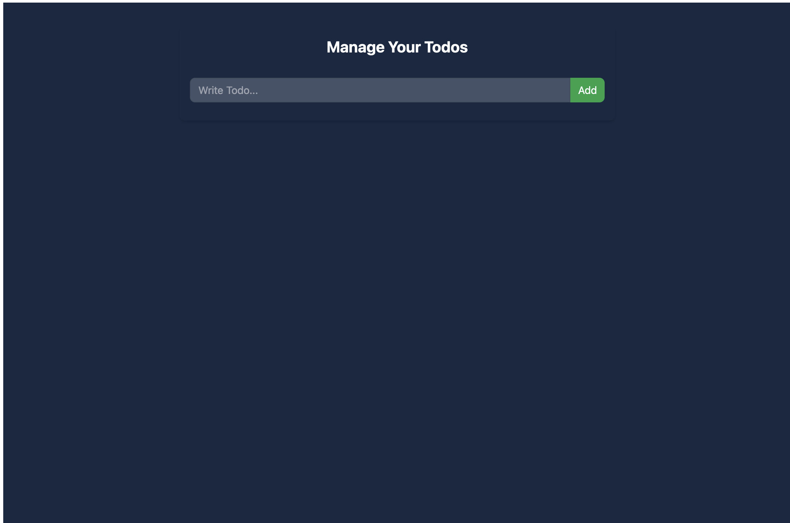
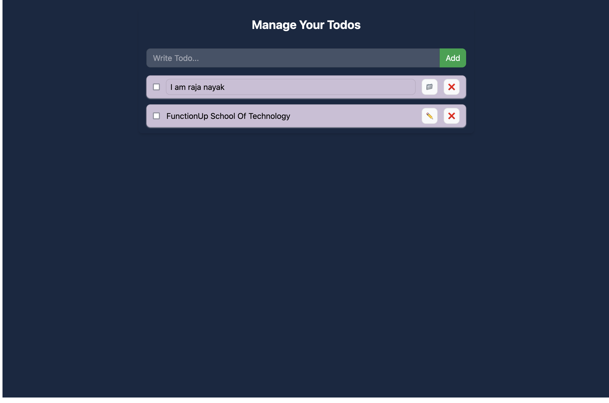

<h1>Todo List &nbsp; 🧾</h1>

### About Project 👇

    In this project, i created a to-do app to understand the basics of ReactJS and "Context API". I working with function based components in this application and use the Tailwind CSS to style the components. This to-do list can add new tasks we can also delete the tasks by clicking on them. The logic is handled by a click event handler whenever the user clicks on a task it gets deleted from the list.

### Features Of Todolist 
 - <h4>Read a list of tasks .</h4>
 - <h4>Add a task using the mouse or keyboard.</h4>
 - <h4>Mark any task as completed, using the mouse or keyboard.</h4> 
- <h4>Delete any task, using the mouse or keyboard.</h4>
- <h4>Edit any task, using the mouse or keyboard.</h4>

### Prerequisites 

- Basic knowledge of HTML, CSS, and JavaScript.
- Node.js and npm installed on your computer.
- A code editor like Visual Studio Code.

### Set Up the Project

    1. Create a React App

    Open your terminal Run the following command to generate a new React app. 

    👉  npm create vite@latest

    2. Navigate to the Project Directory

    Change your working directory to the “todo-app” folder:

    👉  cd todo-app

 

    3. Start the Development Server

    Launch the development server with the following command:

    👉  npm run dev

### Folder Structure

    Step 2: Create the App Component

    Step 3: Create the Component folder containe TodoForm.jsx and TodoItems.jsx

    Step 4: Create the Context folder that containe TodoContext.js it work
    global variable that provide features

### Preview Image 👇

  &nbsp;
  
